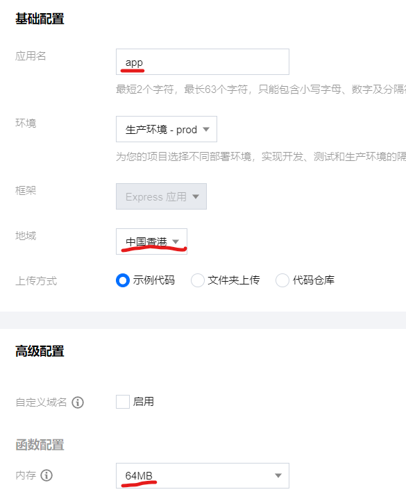
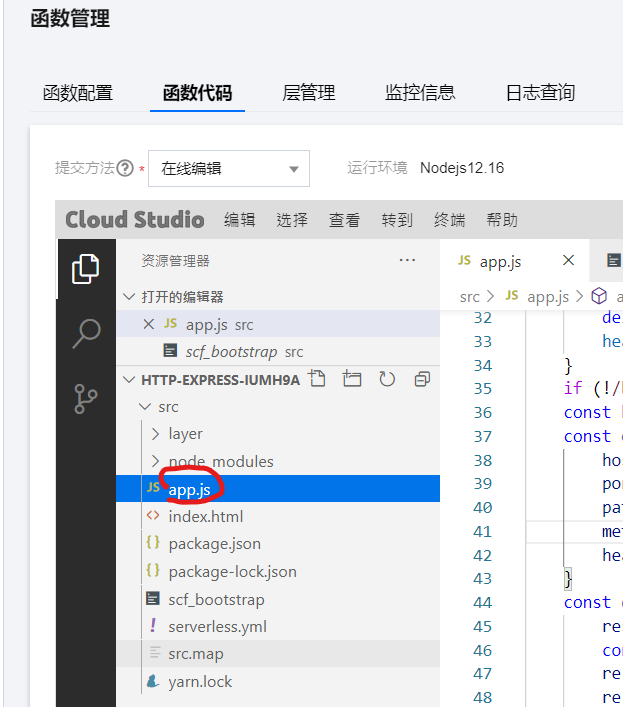
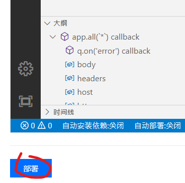
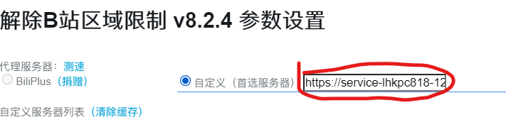

Here is a node script for proxy api.bilibili.com

you can depoly it in HK to unlock  areblock.

#### Example:

##### How to use

- 1.go to [https://console.cloud.tencent.com](https://console.cloud.tencent.com/)
- 2.Create a Serverless app, Choose Web App - Express app
- 3.Choose HK 

- 4.After depoly done,go to Functions Service

- 5.Click the function name
- 6.Replace app.js  
   
 
- 7.Depoly     

 
- 8.Fill your app address width /playurl  e.g `https://service-XXXXXXX.hk.apigw.tencentcs.com/release/playurl`

     
